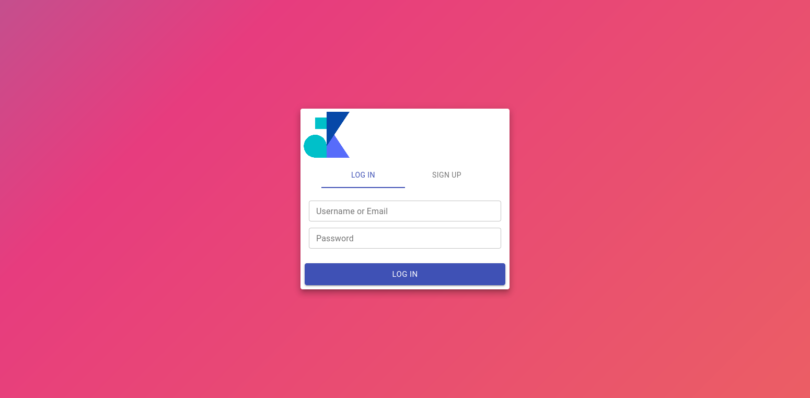
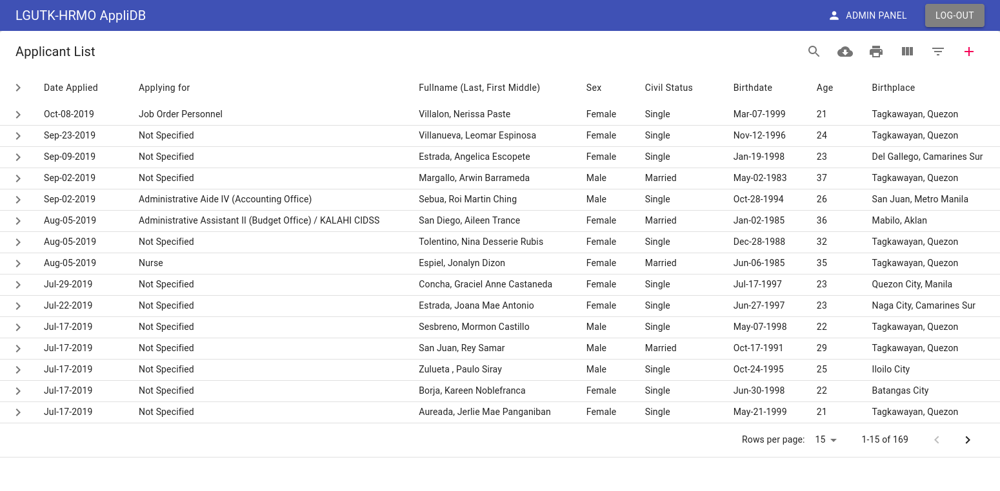
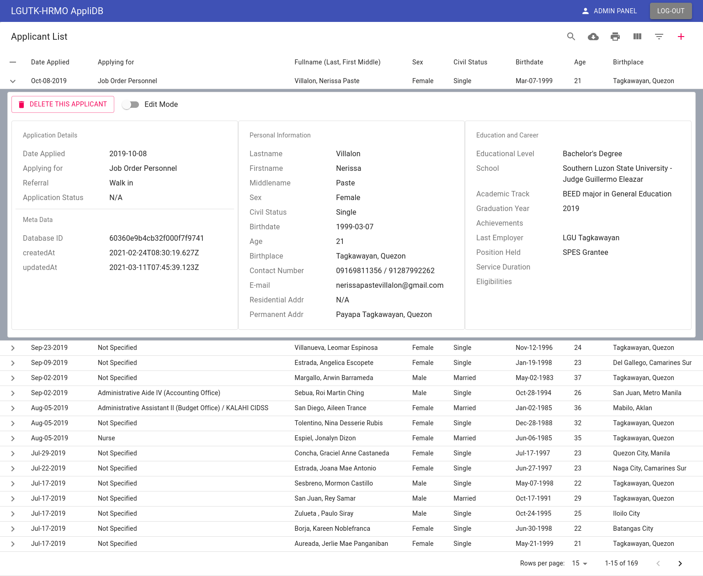
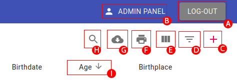
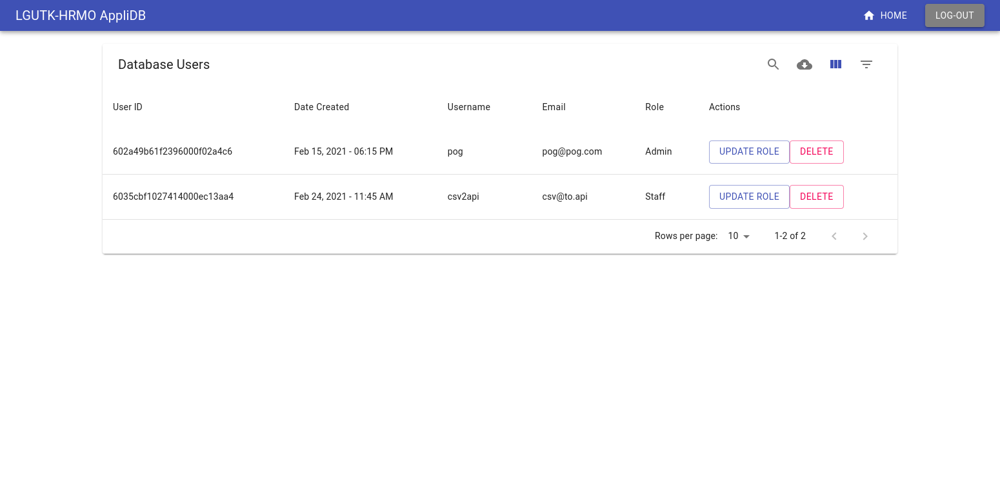
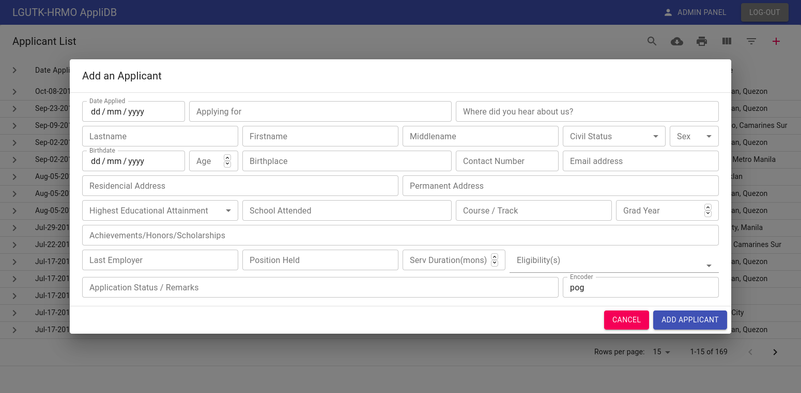
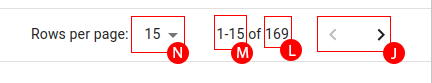

# LGU-TK HRMO Applicant Database

A Database for the applicants of LGU-TK HRMO.

## Architechture

This project uses **MongoDB** as its backend, **Strapi** as its API server, and **nginx** to serve built **ReactJS** scripts as its frontend. The project is designed to be deployed in a local/private environment instead of being in public servers. A **Docker** file was included to ease deployment.

## DB Schema

### Applicants

| Field             | Datatype |   isRequired |
| ----------------- | :------: | -----------: |
| date_applied      |   date   |     required |
| applying_for      |   text   |     required |
| lname             |   text   |     required |
| fname             |   text   |     required |
| mname             |   text   |     required |
| sex               |   enum   |     required |
| civil_status      |   enum   |     required |
| birthdate         |   date   |     required |
| age               |  number  |     required |
| birthplace        |   text   |     required |
| res_address       |   text   |     required |
| perm_address      |   text   |     required |
| contact_num       |   text   | not required |
| email             |  email   | not required |
| nth_edu_attain    |   enum   |     required |
| school            |   text   |     required |
| acad_track        |   text   |     required |
| grad_year         |  number  |     required |
| achievements      |   text   | not required |
| last_employer     |   text   | not required |
| position_held     |   text   | not required |
| serv_duration_mon |  number  | not required |
| appli_status      |   text   | not required |
| eligibility       |   enum   | not required |
| referral          |   text   | not required |
| encoder           |   text   |     required |

### Privileges

| Roles   | Create | Read | Update | Delete | Change User Role |
| ------- | :----: | :--: | :----: | :----: | :--------------: |
| Admin   |   ✓    |  ✓   |   ✓    |   ✓    |        ✓         |
| Staff   |   ✓    |  ✓   |        |        |                  |
| Visitor |        |  ✓   |        |        |                  |

- When a new User signs in, he/she is considered as a _Visitor_ until an Admin changes his/her role.

## Frontend and Controls

When configured correctly, the system could be seen in a browser with the link `http://<server-IP>:3000`. You can either `log-in` or `sign-up`.

Remember that newly created _Users_ is considered as a _Visitor_ until an Admin changes his/her role. After authentication, you will be directed to the home-page.

This is where majority of the controls exist. First of all, the table. Since there is not alot of space to display all the data, the table is made to _expand_ upon request. Simply click the row you want to know more about and it will expand to show all hidden data.

From this expanded form you will be able to **delete** and/or **update** the selected applicant (Only an _Admin_ is allowed to Update and Delete applicants).

Looking at the top-right of the page, there are a few buttons/actions that could be done.

| Letter | Name          | Description                       |
| :----: | :------------ | :-------------------------------- |
|   A    | Logout        | This will logout the current user |
|   B    | Admin Panel   | [description](#admin-panel)       |
|   C    | Add Applicant | [description](#add-applicant)     |
|   D    | Filter        | ?                                 |
|   E    | Columns       | ?                                 |
|   F    | Print         | Print the displayed data in HTML  |
|   G    | Download      | ?                                 |
|   H    | Search        | ?                                 |
|   I    | Column Title  | ?                                 |

### Admin Panel

The Admin Panel is where an Admin can **change** a user's current role, **delete** a certain user, and **see** all user who are accessing/have access to the system. The button to go the admin panel will not be vissible to users without the admin role.

### Add Applicant

The Add Applicant Dialog is where you can add an applicant to the database. Be mindful of the required fields in the [applicants](#applicants) section, for the User Interface(UI) will give a _ValidationError_ if you miss one of those fields.

