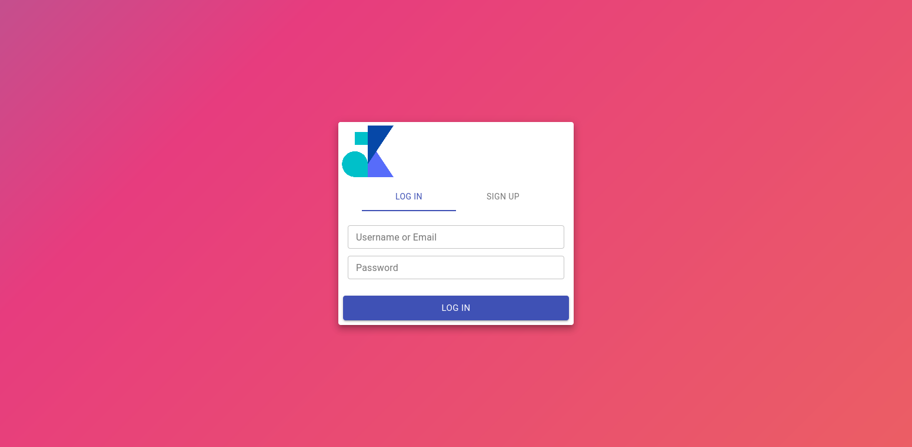
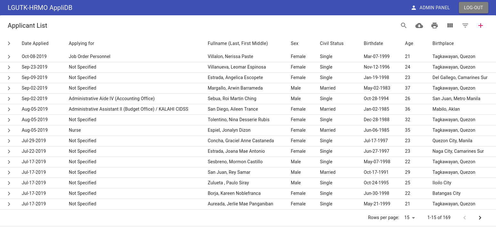
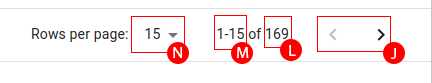
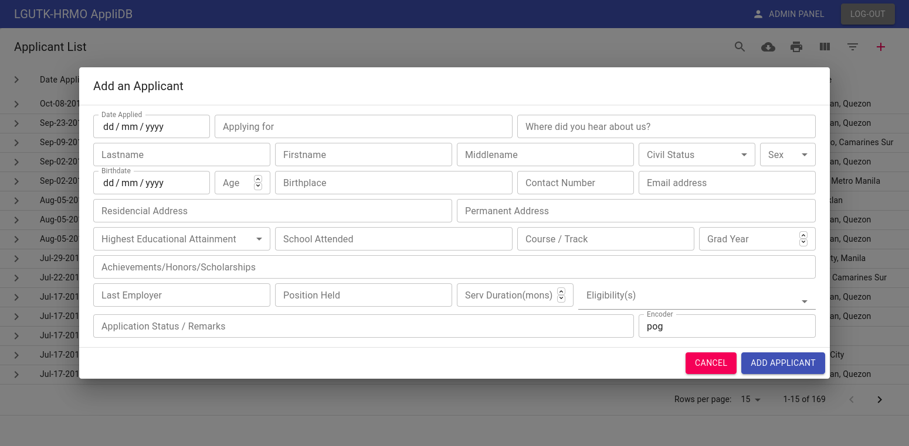

# User Manual

## System Architecture

This project uses **MongoDB** as its backend, **Strapi** as its API server, and **Nginx** to serve built **ReactJS** scripts as its frontend. The project is designed to be deployed in a local/private environment instead of being in public servers. A **Docker** file was included to ease deployment.

## DB Schema (MongoDB)

### Applicants

| Field             | Datatype |   isRequired |
| ----------------- | :------: | -----------: |
| date_applied      |   date   |     required |
| applying_for      |   text   |     required |
| lname             |   text   |     required |
| fname             |   text   |     required |
| mname             |   text   |     required |
| sex               |   enum   |     required |
| civil_status      |   enum   |     required |
| birthdate         |   date   |     required |
| age               |  number  |     required |
| birthplace        |   text   |     required |
| res_address       |   text   |     required |
| perm_address      |   text   |     required |
| contact_num       |   text   | not required |
| email             |  email   | not required |
| nth_edu_attain    |   enum   |     required |
| school            |   text   |     required |
| acad_track        |   text   |     required |
| grad_year         |  number  |     required |
| achievements      |   text   | not required |
| last_employer     |   text   | not required |
| position_held     |   text   | not required |
| serv_duration_mon |  number  | not required |
| appli_status      |   text   | not required |
| eligibility       |   enum   | not required |
| referral          |   text   | not required |
| encoder           |   text   |     required |

### Privileges (Strapi)

| Roles   | Create | Read | Update | Delete | Change User Role |
| ------- | :----: | :--: | :----: | :----: | :--------------: |
| Admin   |   ✓    |  ✓   |   ✓    |   ✓    |        ✓         |
| Staff   |   ✓    |  ✓   |        |        |                  |
| Visitor |        |  ✓   |        |        |                  |

- When a new User signs in, he/she is considered as a _Visitor_ until an Admin changes his/her role.

## Frontend and Controls (ReactJS)

When configured correctly, the system could be seen in a browser with the link `http://<server-IP>:3000`. You can either `log-in` or `sign-up`.

Remember that newly created _Users_ is considered as a _Visitor_ until an Admin changes his/her role. After authentication, you will be directed to the home-page.

This is where majority of the controls exist.

First of all, the table. Since there is not alot of space to display all the data, the table is made to _expand_ upon request. Simply click the row you want to know more about, and it will expand to show all hidden data.

From this expanded form, you will be able to **delete** and/or **update** the selected applicant (Only an _Admin_ is allowed to Update and Delete applicants).

Looking at the top-right of the page, there are a few buttons/actions that could be done.

| Letter | Name          | Description                             |
| :----: | :------------ | :-------------------------------------- |
|   A    | Logout        | This will logout the current user       |
|   B    | Admin Panel   | [description](#admin-panel)             |
|   C    | Add Applicant | [description](#add-applicant)           |
|   D    | Filter        | [description](#filter)                  |
|   E    | Columns       | Select the columns the table displays   |
|   F    | Print         | Print the displayed data as HTML        |
|   G    | Download      | [description](#download)                |
|   H    | Search        | Search the database for a term          |
|   I    | Column Title  | Column Titles are clickable for Sorting |

There are also a few controls and indicators in the bottom-right

| Letter | Name      | Description                                   |
| :----: | :-------- | :-------------------------------------------- |
|   J    | Table Nav | Used to flip through table pages              |
|   L    | Records   | The total number of records in the database   |
|   M    | Showing   | Indicates what the table is currently showing |
|   N    | Columns   | Choose the number of applicants shown at once |

---

### Admin Panel

The Admin Panel is where an Admin can **change** a user's current role, **delete** a certain user, and **see** all user who have access to the system. The button to go the admin panel will not be vissible to users without the admin role.

### Add Applicant

The Add Applicant Dialog is where you can add an applicant to the database. Be mindful of the required fields in the [applicants](#applicants) section, for the User Interface(UI) will give a _ValidationError_ if you miss one of those fields.

### Filter

There are only a few columns you can filter, for the reason that some fields stores unique data formats, this will only affect the effectivity of the filter feature.

Be careful formatting fields that accepts the 'text' datatype (Ex. "Tagkawayan, Quezon" and "Tagkawayan Quezon" are considered different and would be rendered as 2 seperate options for filtering).

Filtering is affected by _pagination_ (the table can only filter the data it has. And pagination is affected by the API calls and the responses the system makes. [ API calls >>> Pagination >>> Filter, Sort, Search, Print ]. See [Bugs and Flaws](#bugs-and-flaws))

There are optimizations in place to help with the API calls, but it is not as solid, so watch out.

### Download

This is the preferred action when **printing reports** and **archiving** because it outputs CSV files. CSV files are preferred because it has a relatively small file size, and it can be opened and edited in Microsoft Excel where it could be styled and printed accordingly.

---

### Bugs and Flaws

- One of the problems faced by databases that will be scaled to store growing amounts of data is the problem of data presentation. In a _client-server_ systems like this, the data is stored in the _server_, batches of data is then thrown to the _client_ so it can be displayed in a meaningful way (this includes Sorting, Filtering, and Searching). The problem comes when the client struggles to load the data the server throws.
