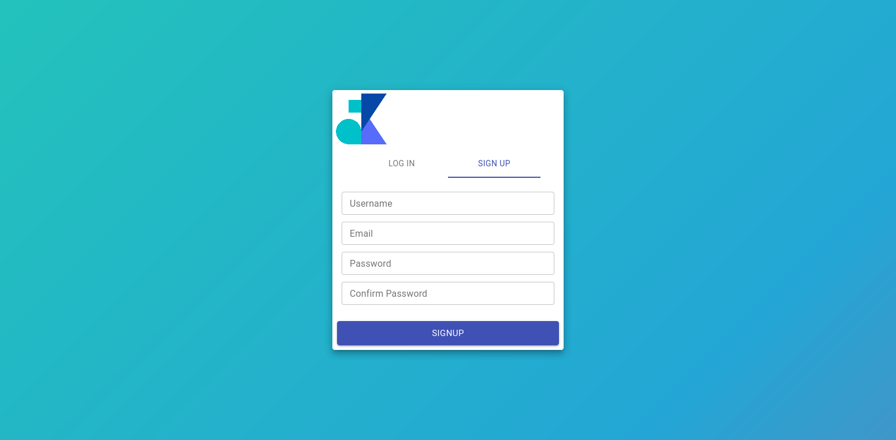
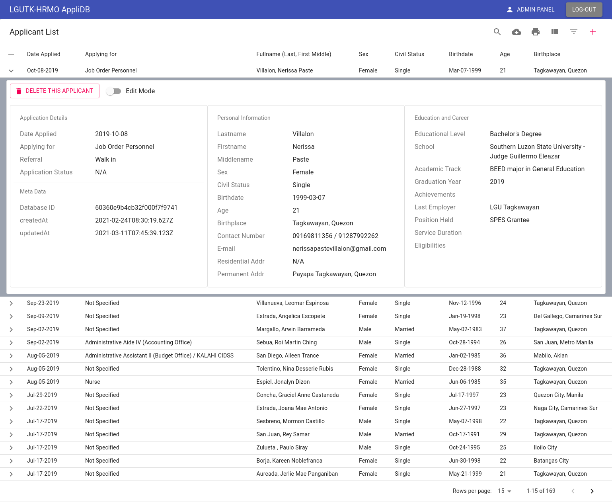
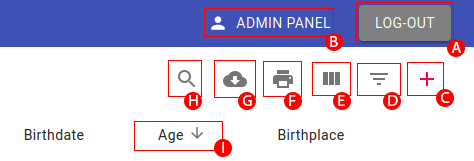
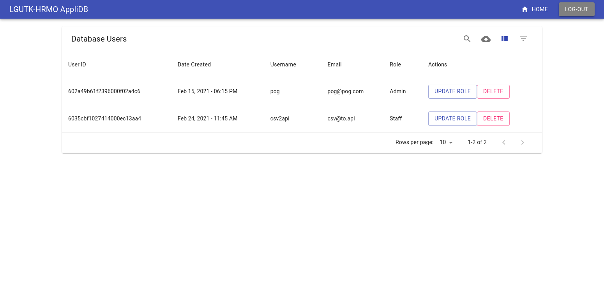

# LGU-TK HRMO AppliDB User Manual

## System Architecture

This project uses **MongoDB** as its backend, **Strapi** as its API server, and **Nginx** to serve built **ReactJS** scripts as its frontend. This project is meant to be deployed in a local/private environment instead of being in public servers. A **Docker** file was included to ease deployment.

## DB Schema (MongoDB)

### Applicants

| Field             | Datatype |   isRequired |
| ----------------- | :------: | -----------: |
| date_applied      |   date   |     required |
| applying_for      |   text   |     required |
| lname             |   text   |     required |
| fname             |   text   |     required |
| mname             |   text   |     required |
| sex               |   enum   |     required |
| civil_status      |   enum   |     required |
| birthdate         |   date   |     required |
| age               |  number  |     required |
| birthplace        |   text   |     required |
| res_address       |   text   |     required |
| perm_address      |   text   |     required |
| contact_num       |   text   | not required |
| email             |  email   | not required |
| nth_edu_attain    |   enum   |     required |
| school            |   text   |     required |
| acad_track        |   text   |     required |
| grad_year         |  number  |     required |
| achievements      |   text   | not required |
| last_employer     |   text   | not required |
| position_held     |   text   | not required |
| serv_duration_mon |  number  | not required |
| appli_status      |   text   | not required |
| eligibility       |  array   | not required |
| referral          |   text   | not required |
| encoder           |   text   |     required |

### Privileges (Strapi)

| Roles   | Create | Read | Update | Delete | Change User Role |
| ------- | :----: | :--: | :----: | :----: | :--------------: |
| Admin   |   ✓    |  ✓   |   ✓    |   ✓    |        ✓         |
| Staff   |   ✓    |  ✓   |        |        |                  |
| Visitor |        |  ✓   |        |        |                  |

- When a new User signs in, he/she is considered as a _Visitor_ until an Admin changes his/her role.
- There can be **multiple** _Admin_, _Staff_, and _Visitor_.
- An _Admin_ can designate another _Admin_.

## Frontend and Controls (ReactJS)

The system will run on a mobile devices (mobile browser); however, the User Interface (_UI_) is optimized for devices with larger screens.

When configured correctly, the system could be seen in a browser with the link `http://<server-IP>:3080`.

<!--  -->

Remember that newly created _Users_ are considered as a _Visitor_ until an Admin changes his/her role. After authentication, you will be directed to the home-page.

This is where majority of the controls exist.

First of all, the table. Since there is not alot of space to display all the data, the table is made to _expand_ upon request. Simply click the row you want to know more about, and it will expand to show all hidden data.

From this expanded form, you will be able to **delete** and/or **update** the selected applicant (Only an _Admin_ is allowed to Update and Delete applicants).

Looking at the top-right of the page, there are a few buttons/actions that could be done.

| Letter | Name          | Description                             |
| :----: | :------------ | :-------------------------------------- |
|   A    | Logout        | This will logout the current user       |
|   B    | Admin Panel   | [description](#admin-panel)             |
|   C    | Add Applicant | [description](#add-applicant)           |
|   D    | Filter        | [description](#filter)                  |
|   E    | Columns       | Select the columns the table displays   |
|   F    | Print         | Print the displayed data as HTML        |
|   G    | Download      | [description](#download)                |
|   H    | Search        | Search the table for a term             |
|   I    | Column Title  | Column Titles are clickable for Sorting |

There are also a few controls and indicators in the bottom-right

| Letter | Name      | Description                                   |
| :----: | :-------- | :-------------------------------------------- |
|   J    | Table Nav | Used to flip through table pages              |
|   L    | Records   | The total number of records in the database   |
|   M    | Showing   | Indicates what the table is currently showing |
|   N    | Rows      | The number of applicants shown per page       |

---

### Admin Panel

The Admin Panel is where an Admin can **change** a user's current role, **delete** a certain user, and **see** all user who have access to the system. The button to get the admin panel will not be vissible to users without the admin role.

### Add Applicant

The Add Applicant Dialog is where you can add an applicant to the database. Be mindful of the required fields in the [applicants](#applicants) section, because the User Interface(UI) will give a _ValidationError_ if you miss one of those fields. Use "N/A" if nessesary.

### Filter

There are only a few columns you can filter because some fields stores unique data formats and is not worth filtering.

Filtering for **Eligibilities**, **Residential Addresses**, and **Permanent Addresses** can be tricky.

- **Eligibilities** are formated as _array of values_, using _Filter_ on this format might produce inaccurate results. _Search_ might be better for this usecase.
- **Residential Address** and **Permanent Address** can differ per person.

### Download

This is the preferred action when **printing reports** and **archiving data** because it outputs CSV files. CSV files are preferred because it has a relatively small file size, and it can be opened and edited in _Microsoft Excel_ where it could be styled and printed accordingly.

### System behaviors to watch out for

- On first startup, or if you reload the page, the system will try to fetch a fresh copy of the list of applicants. This fetch will become substantial if the list is long. I suggest limiting the times you try to reload the page. (the system always tries to fetch 1000 records at a time untill all records have been fetched).
- Be careful formatting fields that accepts the 'text' datatype (Ex. "Tagkawayan, Quezon" and "Tagkawayan Quezon" are considered different and would be rendered as 2 seperate options for filtering).
- The _Print_ feature only prints the HTML version of the table. This can become problematic when printing several visible columns. See [Download](#download) for an alternative.
- The sytem can struggle serving multiple concurrent users (>15) especially if the database has grown to store a large amounts of applicants (>20,000). In this case, **Archiving** and deleting some data is recommended.
- Filtering for _ranges_ (Age ranges, Date ranges, etc.) can not be done in the _Filter_ feature. You can use the _Sort_ feature to arrange records to either ascending or descending order, then only extract the necessary group/range.
- User's authentication details are only stored in the browser's _sessionStorage_. This means that if you closed the current tab, or close the browser itself, you will be loged out. This behavior is intended for added security.
- The system is accessed using the server's IP-address. IP-address changes overtime. One solution is to set a static IP for the server, however this will still affect accessibility because you'll still have to remember the server's IP to access the site.
